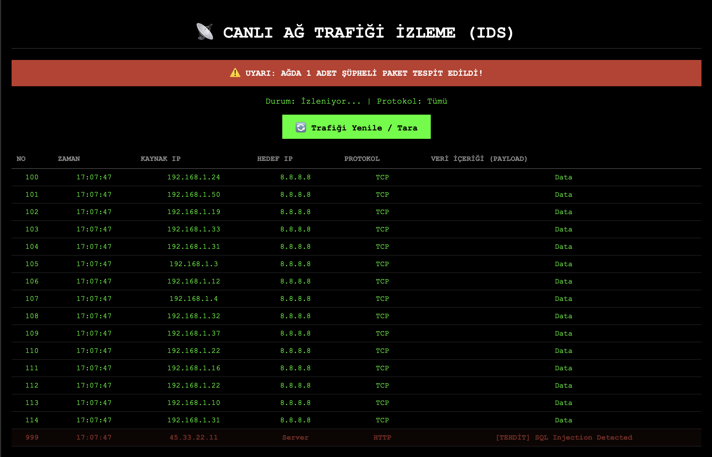
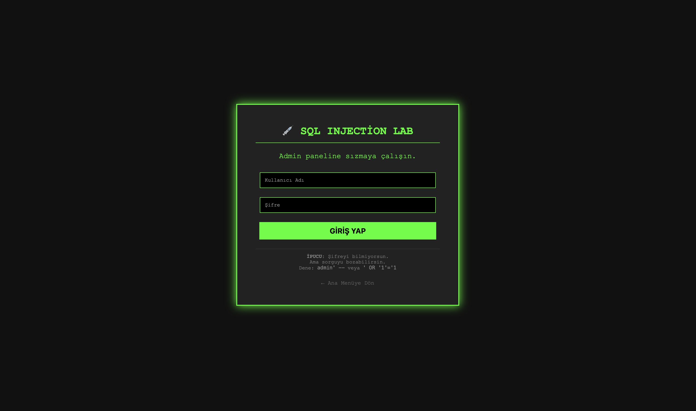

# 🛡️ CyberSec Ultimate - Siber Güvenlik Laboratuvarı

**CyberSec Ultimate**, siber güvenlik farkındalığı oluşturmak, saldırı ve savunma tekniklerini simüle etmek amacıyla Python (Flask) ile geliştirilmiş kapsamlı bir eğitim platformudur.

Modern **Dark Mode** arayüzü, **Yapay Zeka (AI)** destekli analiz motorları ve **Blockchain** tabanlı loglama sistemi ile siber güvenliğin uç noktalarını keşfedin.

---

## 📸 Proje Arayüzü ve Modüller

### 1. Operasyon Kontrol Merkezi (Dashboard)
Projenin kalbi. Tüm saldırı, savunma ve analiz modüllerine tek bir noktadan erişim sağlayan, Cyberpunk temalı profesyonel yönetim paneli.

* **Canlı İstatistikler:** Sistem durumu ve aktif modül takibi.
* **Kategorize Yapı:** İleri Seviye, Ağ Savunması ve Saldırı (Red Team) olarak ayrılmış modüller.

---

### 2. Canlı Ağ Trafiği İzleme (IDS)
Ağ üzerindeki paketleri gerçek zamanlı simüle eden ve anormallikleri tespit eden Saldırı Tespit Sistemi.

* **Tehdit Algılama:** SQL Injection, DDoS veya şüpheli payload içeren paketleri (Kırmızı Uyarı) otomatik yakalar.
* **Protokol Analizi:** TCP, UDP, HTTP protokollerini izler.

---

### 3. Sızma Testi Laboratuvarı (SQL Injection)
Web güvenliğinin en kritik açıklarından biri olan SQL Injection zafiyetini güvenli bir ortamda test edin.

* **Zafiyet Simülasyonu:** Admin paneline yetkisiz giriş senaryoları.
* **Payload Testi:** `' OR '1'='1` gibi klasik saldırı vektörlerini deneyimleyin.

---

## 🚀 Özellikler (12 Modül)

Bu laboratuvar ortamı 3 ana kategoride 12 gelişmiş araç sunar:

### 🔴 İleri Seviye Tehditler (Advanced)
* **💀 Ransomware Simülatörü:** Dosyaları AES-128 (Fernet) ile gerçekten şifreleyen ve fidye isteyen zararlı yazılım simülasyonu.
* **🧠 AI Phishing Dedektörü:** URL yapılarını makine öğrenimi mantığıyla analiz edip "Risk Skoru" hesaplayan yapay zeka modülü.
* **🔗 Blockchain Log Sistemi:** Sistem kayıtlarını kriptografik zincirlerle saklayan ve değiştirilemezliğini (Immutability) garanti eden loglama yapısı.

### 🔵 Savunma & Analiz (Blue Team)
* **👁️ IDS (Saldırı Tespit Sistemi):** Ağ trafiği anomali tespiti.
* **📡 Port Tarayıcı:** Hedef sistemdeki açık servisleri (SSH, FTP, HTTP) keşfetme.
* **🔐 Parola Analizi:** Şifrelerin matematiksel gücünü (Entropy) ve kırılma süresini hesaplama.
* **#️⃣ Hash Hesaplama:** SHA-256 algoritması ile veri bütünlüğü ve dosya doğrulama.

### ⚔️ Saldırı Simülasyonları (Red Team)
* **💉 SQL Injection:** Veritabanı manipülasyon testleri.
* **☠️ XSS (Cross-Site Scripting):** Tarayıcı tabanlı saldırı senaryoları.
* **🔨 Brute Force:** PIN ve şifre kırma hız testi.

### 🟣 Gizlilik Araçları
* **🕵️‍♂️ Steganografi:** Resim dosyalarının piksel kodlarına (LSB Tekniği) gizli mesaj saklama.
* **🗝️ Kriptografi:** Sezar şifreleme algoritması laboratuvarı.

---

## 🛠️ Kurulum ve Çalıştırma

Projeyi kendi bilgisayarınızda çalıştırmak için aşağıdaki adımları izleyin:

1.  **Projeyi Klonlayın:**
    ```bash
    git clone [https://github.com/KULLANICI_ADINIZ/Siber-Guvenlik-Arac-Kutusu.git](https://github.com/KULLANICI_ADINIZ/Siber-Guvenlik-Arac-Kutusu.git)
    cd Siber-Guvenlik-Arac-Kutusu
    ```

2.  **Gerekli Kütüphaneleri Yükleyin:**
    ```bash
    pip install -r requirements.txt
    ```

3.  **Uygulamayı Başlatın:**
    ```bash
    python app.py
    ```

4.  **Tarayıcıda Açın:**
    Adres çubuğuna `http://127.0.0.1:5000` yazarak laboratuvara erişebilirsiniz.

---

## ⚠️ Yasal Uyarı

Bu proje **sadece eğitim ve akademik amaçlar** için geliştirilmiştir. İçerdiği saldırı simülasyonları (Ransomware, SQLi vb.) yalnızca izin verilen, izole edilmiş ortamlarda (Sandbox) ve kendi sistemlerinizde kullanılmalıdır. Kötüye kullanımda sorumluluk kullanıcıya aittir.

---
**Geliştirici:** [Senin Adın]